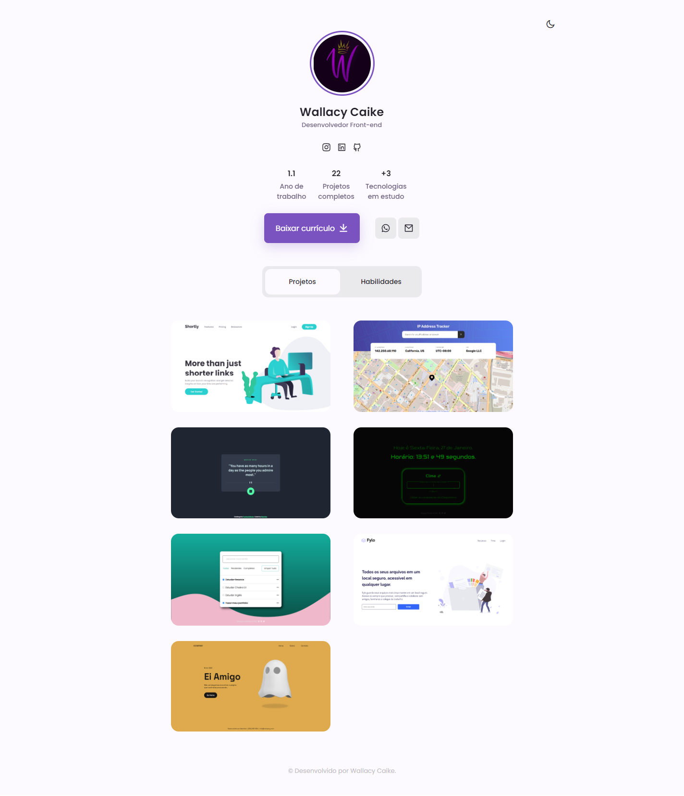

<h1 align="center">
  Portfólio - Wallacy Caike
</h1>

<h4 align="center"><a href="https://wat-portfolio.vercel.app">Clique para visitar o projeto</a></h4>

## 📝 Um pouco sobre

A ideia principal por trás deste projeto era desenvolver um portfólio minimalista e 100% útil, demonstrando assim minhas habilidades com as tecnologias utilizadas.

_Com o passar do tempo irei atualizando este projeto, provavelmente implementando coisas novas, e também utilizando novas tecnologias._

---

## 📚 Seções

O site é composto por quatro seções:

- **Home:** Contém informações básicas e necessárias sobre mim.
- **Contato:** Download do meu CV (Currículo) e redes sociais para entrar em contato comigo.
- **Projetos:** Mostra projetos desenvolvidos por mim com link direto para os mesmos.
- **Habilidades:** Área que exibe minhas habilidades como desenvolvedor, linguagens, tecnologias e etc...

---

## 💼 Tecnologias utilizadas

Para o desenvolvimento deste site foi utilizado:

- React
- React Hooks
- Sass
- ScrollReveal
- Remix Icons
- Dopely Colors

---

<h2>🤞 Autor</h2>

<table>
  <tr>
    <td align="center">
      <a href="https://github.com/wallacycaike">
         
        
          <b>Wallacy Caike</b>
        
      </a>
    </td>
  </tr>
</table>
